# Architecture Flow

```mermaid
---
config:
  layout: fixed
---

flowchart TB
 subgraph Legend["📊 LEGEND: Main Flow → | Security ⛔ | Monitoring ⋯⋯"]
        L1["🔵 Phases | 🔴 Security | 🟢 Unity Catalog | 🟡 Compute | 🟣 MLOps | 🔻 Threats"]
  end
 subgraph User["👤 USER INTERFACE LAYER"]
        U1["STEP 1: User submits Natural Language Query"]
        U2["AI/BI Genie Interface"]
        U3["Databricks Assistant in Notebooks/SQL Editor"]
  end
 subgraph Phase1["📥 PHASE 1: Ingestion & Pre-processing"]
        I1["STEP 2: Query Ingestion"]
        I2["STEP 3: ai_fix_grammar Function<br>Grammar/Spelling Normalization"]
        I3["STEP 4: Input Safety Guardrail<br>Llama Guard 2"]
        I4{"STEP 5: Malicious Content<br>Detected?"}
        I5["❌ Block Request<br>Return Error"]
  end
 subgraph Phase2["🔍 PHASE 2: RAG Context Retrieval"]
        R1["STEP 6: Query Unity Catalog Metastore"]
        R2["STEP 7a: Retrieve Schema Information"]
        R3["STEP 7b: Retrieve Column Descriptions"]
        R4["STEP 7c: Retrieve Sample Queries/Examples"]
        R5["STEP 8: Apply User ACL Filtering"]
        R6{"STEP 9: User has<br>Access?"}
        R7["STEP 10: Filter Metadata by Permissions"]
        R8["STEP 11: Genie Space Configuration<br>Domain Expert Annotations"]
        R9["STEP 12: Assemble Context Payload"]
  end
 subgraph Phase3["🤖 PHASE 3: LLM Inference"]
        P1["STEP 13: Construct System Prompt<br>with Constraints"]
        P2["STEP 14: System Prompt Hardening<br>Ignore Override Attempts"]
        P3["STEP 15: Concatenate:<br>Context + System Prompt + User Query"]
        P4["STEP 16: Finalized Inference Prompt"]
        P5["STEP 17: Foundation Model API"]
        P6["STEP 18: LLM Inference<br>Llama3 8B / Azure OpenAI / Custom"]
        P7["STEP 19: Generate SQL/Python Code"]
        P8["STEP 20: Output Safety Filter<br>Llama Guard 2"]
        P9{"STEP 21: Generated Code<br>Contains Harmful<br>Content?"}
        P10["❌ Block Code<br>Return Error"]
  end
 subgraph Phase4A["✅ PHASE 4A: Validation"]
        V1["STEP 22: Security & ACL Validation"]
        V2["STEP 23: Parse Generated SQL/Python"]
        V3["STEP 24: Extract Referenced Tables/Columns"]
        V4["STEP 25: Query Unity Catalog ACLs"]
        V5{"STEP 26: User has READ<br>permission for ALL<br>referenced assets?"}
        V6["❌ Reject Execution<br>Unauthorized Access Attempt"]
        V7["STEP 27: Code Syntax Validation"]
        V8{"STEP 28: Valid SQL/<br>Python Syntax?"}
        V9["❌ Reject - Syntax Error"]
  end
 subgraph ControlPlane["🎛️ CONTROL PLANE - Databricks Managed Cloud"]
        Phase1
        Phase2
        Phase3
        Phase4A
  end
 subgraph Phase4B["⚙️ PHASE 4B: Execution"]
        E1["Serverless Compute"]
        E2["Classic Compute"]
        E3{"STEP 29: Compute<br>Type?"}
        E4["STEP 30: Execute SQL Query"]
        E5["STEP 31: Execute Python Code"]
        E6["STEP 32: Spark Cluster Processing"]
        E7["STEP 33: Access Customer Data<br>within ACL boundaries"]
        E8["STEP 34: Generate Results"]
        E9["STEP 35: Create Visualizations"]
  end
 subgraph ComputePlane["☁️ COMPUTE PLANE - Customer Cloud Account"]
        Phase4B
  end
 subgraph UnityLayer["🛡️ UNITY CATALOG - Governance Layer"]
        UC1["💾 Unity Catalog<br>Metastore"]
        UC2["Data Classification"]
        UC3["Asset Permissions"]
        UC4["Table/Column Descriptions"]
        UC5["Lineage Information"]
        UC6["Access Control Lists ACLs"]
        UC7["Audit Logs"]
  end
 subgraph SecurityFramework["🔐 DATABRICKS AI SECURITY FRAMEWORK - DASF"]
        S1["62 Technical Security Risks"]
        S2["64 Prescriptive Controls"]
        S3["Zero Data Retention ZDR"]
        S4["Model Serving Isolation"]
        S5["Mosaic AI Gateway"]
  end
 subgraph MLOps["📈 MLOps & LLMOps Framework"]
        M1["Continuous Evaluation"]
        M2["User Feedback Collection"]
        M3["Semantic Knowledge Updates"]
        M4["MLflow Experiment Tracking"]
        M5["Prompt Variation Testing"]
        M6["Performance Monitoring"]
        M7["Red Team Testing"]
        M8["Adversarial Testing"]
  end
 subgraph Threats["⚠️ Threat Vectors & Mitigations"]
        T1["Prompt Injection PI Attacks"]
        T2["Schema Inference Attacks"]
        T3["ToxicSQL Backdoors"]
        T4["Unauthorized Data Access"]
        T5["Data Manipulation DDL/DML"]
  end
 subgraph Results["📊 Results & Feedback Loop"]
        RES1["STEP 36: Return Results to User"]
        RES2["STEP 37: Display Tables/Charts"]
        RES3["STEP 38: Automated Visualizations"]
        RES4["STEP 39: Collect User Feedback"]
        RES5["STEP 40: Log Query Performance"]
        RES6["STEP 41: Update Genie Knowledge Base"]
  end
    U1 --> U2 & U3
    U2 --> I1
    U3 --> I1
    I1 --> I2
    I2 --> I3
    I3 --> I4
    I4 -- Yes --> I5
    I5 --> RES1
    I4 -- "No - Safe" --> R1
    R1 --> UC1
    UC1 --> R2 & R3 & R4 & UC2 & UC3 & UC4 & UC5 & UC6 & UC7
    R2 --> R5
    R3 --> R5
    R4 --> R5
    R5 --> R6
    R6 -- Yes --> R7
    R6 -- No --> I5
    R7 --> R8
    R8 --> R9
    R9 --> P1 & P3
    P1 --> P2
    P2 --> P3
    P3 --> P4
    P4 --> P5
    P5 --> P6
    P6 --> P7
    P7 --> P8
    P8 --> P9
    P9 -- Yes --> P10
    P10 --> RES1
    P9 -- "No - Safe" --> V1
    V1 --> V2
    V2 --> V3
    V3 --> V4
    V4 --> UC1 & V5
    V5 -- No --> V6
    V6 --> RES1
    V5 -- Yes --> V7
    V7 --> V8
    V8 -- No --> V9
    V9 --> RES1
    V8 -- Yes --> E3
    E3 -- Serverless --> E1
    E3 -- Classic --> E2
    E1 --> E4 & E5
    E2 --> E4 & E5
    E4 --> E6
    E5 --> E6
    E6 --> E7
    E7 --> E8
    E8 --> E9
    E9 --> RES1
    RES1 --> RES2
    RES2 --> RES3
    RES3 --> RES4
    RES4 --> RES5
    RES5 --> RES6
    RES6 --> M3
    S3 -. Enforces .-> P6
    S4 -. Isolates .-> E6
    S5 -. Manages .-> I3 & P8
    S1 -. Addresses .-> T1 & T2 & T3
    S2 -. Mitigates .-> T4 & T5
    M1 -. Monitors .-> P6
    M2 -. Feeds .-> M3
    M3 -. Updates .-> R8
    M4 -. Tracks .-> P5
    M5 -. Tests .-> P3
    M6 -. Observes .-> E6
    M7 -. Tests .-> I3
    M8 -. Validates .-> V1
    P2 -. Mitigates .-> T1
    I3 -. Blocks .-> T1
    P8 -. Blocks .-> T1
    R5 -. Prevents .-> T2
    V5 -. Blocks .-> T3 & T5
    V5 -. Prevents .-> T4
    UC6 -. Enforces Against .-> T2 & T4
     I3:::securityStyle
     P8:::securityStyle
     V1:::securityStyle
     V5:::securityStyle
     E1:::computeStyle
     E2:::computeStyle
     E3:::computeStyle
     E4:::computeStyle
     E5:::computeStyle
     E6:::computeStyle
     E7:::computeStyle
     UC1:::ucStyle
     UC2:::ucStyle
     UC3:::ucStyle
     UC4:::ucStyle
     UC5:::ucStyle
     UC6:::ucStyle
     UC7:::ucStyle
     S1:::securityStyle
     S2:::securityStyle
     S3:::securityStyle
     S4:::securityStyle
     S5:::securityStyle
     M1:::mlopsStyle
     M2:::mlopsStyle
     M3:::mlopsStyle
     M4:::mlopsStyle
     M5:::mlopsStyle
     M6:::mlopsStyle
     M7:::mlopsStyle
     M8:::mlopsStyle
     T1:::threatStyle
     T2:::threatStyle
     T3:::threatStyle
     T4:::threatStyle
     T5:::threatStyle
    classDef phaseStyle fill:#e1f5ff,stroke:#0066cc,stroke-width:2px
    classDef securityStyle fill:#ffe1e1,stroke:#cc0000,stroke-width:2px
    classDef ucStyle fill:#e1ffe1,stroke:#00cc00,stroke-width:2px
    classDef computeStyle fill:#fff9e1,stroke:#cc9900,stroke-width:2px
    classDef mlopsStyle fill:#f0e1ff,stroke:#9900cc,stroke-width:2px
    classDef threatStyle fill:#ff9999,stroke:#990000,stroke-width:2px
```

# Databricks Genie Architecture Documentation

## About

A comprehensive visualization and documentation suite explaining the architecture, security model, and operational mechanics of Databricks Genie's text-to-SQL AI system.

## What This Project Documents

This project provides an in-depth technical explanation of how Databricks Genie transforms natural language questions into secure, accurate SQL queries. Databricks Genie represents a sophisticated approach to bridging the gap between human language and data analysis, but it succeeds where simpler text-to-SQL systems fail precisely because it is not just a large language model. Instead, Genie operates as a compound AI system, combining multiple specialized components, models, and governance layers into an orchestrated architecture that ensures reliability, security, and auditability.

If you have ever wondered how enterprise AI assistants actually work under the hood, or how organizations can deploy generative AI for data analytics without compromising security or governance, this documentation walks you through the complete system architecture, from the moment a user types a question to the execution of validated SQL against their data warehouse.

## Understanding Compound AI Systems

Before diving into the specifics of Genie, you need to understand why it exists as a compound system rather than a simple LLM wrapper. Generic text-to-SQL solutions that rely solely on foundation models often fail in real enterprise environments because they struggle with messy data, ambiguous language, and the nuanced complexities inherent in actual business intelligence work. A model that only sees database schema information lacks crucial context such as defined business processes, metrics definitions, and organizational terminology.

Databricks Genie solves this by architecting a system where the large language model is just one component in a larger orchestration. The LLM provides natural language understanding and code generation capabilities, but it operates within a framework that includes Unity Catalog for metadata and governance, a curated knowledge store for business logic and examples, security filters for input and output validation, and deterministic access control enforcement that prevents unauthorized data access regardless of what the model generates.

This compound approach means that even if an attacker successfully manipulates the LLM through prompt injection to generate malicious SQL, the generated code must still pass through Unity Catalog's access control validation before execution. The security does not rely solely on the AI being unbreakable; instead, it relies on layered defenses where deterministic systems enforce the rules that stochastic models cannot guarantee.

## The Databricks Lakehouse Architecture

To understand how Genie functions, you first need to understand the foundational architecture of the Databricks platform itself, which operates on a two-plane model separating management from data processing.

The control plane acts as the command center, hosted in Databricks-managed cloud infrastructure. This plane contains the web interface, REST APIs, job orchestration, cluster lifecycle management, security controls, and workspace configuration. Critically for our purposes, the control plane also hosts the LLM orchestration logic, the retrieval augmented generation chains, and the prompt construction mechanisms. No customer data resides in the control plane, maintaining strict separation between management operations and actual data processing.

The compute plane functions as the workhorse where actual data operations occur. This plane runs inside the customer's cloud account, whether in classic mode where the customer manages networking and clusters, or in serverless mode where Databricks manages the infrastructure but data remains in the customer's account. All customer data is read, processed, and stored exclusively in the compute plane. When Genie generates SQL, that SQL executes in the compute plane using managed Spark or SQL resources, ensuring that raw data never leaves the customer's security boundary.

This architectural separation has profound implications for security. The LLM inference process in the control plane only sees metadata retrieved from Unity Catalog. The model never has direct access to the raw data in tables. A successful attack at the generation stage can only produce malicious code; it cannot directly exfiltrate data. That generated code must then pass through validation and execute within the isolated compute plane environment.

## Unity Catalog as the Governance Foundation

Unity Catalog serves as the linchpin of Genie's security and reliability architecture. Unity Catalog is not merely a metadata repository but a unified governance layer providing schema details, data lineage, rich semantic context, and most importantly, fine-grained access control.

When domain experts configure Genie spaces, they annotate tables and columns with descriptions that explain what the data represents in business terms. They provide example queries demonstrating common analytical patterns. They define synonyms and business logic that help translate natural language into precise SQL. All of this semantic enrichment lives in Unity Catalog, making it the source of truth for both what data exists and what it means.

But Unity Catalog's most critical security function is access control enforcement. Every query Genie generates must reference only tables and columns that the requesting user has explicit permission to read. During the retrieval phase, when the system gathers context to feed the LLM, it filters metadata strictly according to the user's existing privileges. This means the LLM only sees information about data the user already has access to, implementing the principle of least privilege at the context gathering stage.

Then, before any generated SQL executes, Databricks performs a second deterministic validation check, parsing the generated query to extract every referenced table and column, and verifying that the user possesses the requisite read privileges for all of them. This mandatory validation step acts as a non-AI, deterministic firewall. Even if a sophisticated attack successfully manipulates the LLM into generating SQL that queries unauthorized tables, that SQL will be blocked before execution.

## The Complete Request Workflow

Understanding how a query flows through Genie's architecture reveals how the various security and reliability mechanisms work together. The journey from natural language question to executed SQL follows four distinct phases, each with specific security checkpoints.

Phase one handles ingestion and preprocessing. When a user submits a query through the AI/BI Genie interface or Databricks Assistant, the system first addresses potential input imperfections. The platform employs functions like ai_fix_grammar to normalize spelling and grammatical errors, ensuring downstream components receive a cleaner representation of the user's intent. Immediately after normalization, the raw prompt undergoes its first mandatory security check through an input safety guardrail, potentially implemented using models like Llama Guard 2 integrated via Mosaic AI Gateway. This filter detects and blocks malicious instructions, jailbreak attempts, or harmful content before they reach the main generative model.

Phase two performs contextual grounding through retrieval augmented generation. The cleaned prompt is used to query Unity Catalog's metadata store, retrieving schema information, column descriptions, and potentially sample queries or row-level examples if available and authorized. This retrieval must be scoped exclusively by the user's access privileges, limiting exposed metadata to only what is necessary and authorized. Concurrently, the system constructs a rigid system prompt containing invisible core instructions that define the model's role and explicitly command it to disregard any user input attempting to alter these directives. This system prompt hardening represents the first line of defense against prompt injection attacks.

Phase three executes the LLM inference and code generation. The retrieved context, the constrained system prompt, and the cleaned user query are concatenated into a finalized inference prompt that is passed to the foundation model. The model might be a Databricks-hosted version of Llama3 8B Instruct, a partner model from Azure OpenAI, or a custom foundation model served via the platform's high-performance APIs. The LLM translates the semantic request into a proposed SQL query or Python code. Once generated, this code undergoes output safety filtering as a second guardrail checkpoint, ensuring the generated text does not contain explicitly harmful content even if something slipped past the input filter.

Phase four handles validation and execution, containing the most critical security controls for preventing unauthorized data access. Before the generated SQL is permitted to execute on the compute plane, Databricks performs security and access control list validation by parsing the SQL to extract all referenced tables and columns, then querying Unity Catalog to verify that the user possesses the requisite read privileges. Only if this deterministic check passes does the code execute on managed Spark or SQL resources in the compute plane. Results are then returned to the user along with automated visualizations. User feedback is continuously collected to refine Genie's semantic knowledge and improve future performance.

This multilayered approach ensures that failures at any single layer do not compromise the overall system security. Prompt injection might bypass system prompt constraints, but output filters provide a second check. Even if both filters fail and malicious SQL is generated, the Unity Catalog validation step provides a deterministic security boundary that does not rely on the AI model's reliability.

## Managing Reliability in Stochastic Systems

Generative AI models are fundamentally stochastic, meaning they generate text by predicting the most probable next token in a sequence. This introduces inherent variability: if you submit the same query multiple times with slight modifications, the resulting code or explanation may exhibit differences. The generated response is unlikely to be byte-for-byte identical across runs, especially if the model's temperature parameter is set above zero.

However, Genie achieves enterprise-required consistency by strongly grounding the LLM output in deterministic corporate data assets. The precise schema and semantic definitions drawn from Unity Catalog, combined with predefined guidelines in Genie spaces, constrain the model's creative latitude and maximize output predictability. The LLM's primary function is restricted to translating high-level intent into technical execution against a known, controlled target. This grounding transforms the problem from open-ended text generation to structured code generation with well-defined boundaries.

Building a reliable Genie space requires deliberate curation effort. The quality of generated SQL is directly proportional to the quality of metadata and business context provided. Organizations must follow a systematic approach: first, annotate tables and columns with clear, descriptive comments in Unity Catalog; second, add instructions defining business logic, jargon, and default behaviors in plain text; third, provide trusted hand-written SQL queries as examples for common or complex questions that the model can use as templates; fourth, continuously test with real user questions, collect feedback on responses, and refine the context to improve accuracy over time.

This iterative refinement process constitutes the MLOps framework for maintaining Genie's reliability. Organizations should use experiment tracking capabilities like MLflow to log different prompt variations, parameters, and resulting outputs systematically. This allows engineers to compare the effectiveness of various prompting strategies and semantic models, ensuring that changes enhance rather than degrade query performance and correctness. Production systems require constant monitoring of performance metrics such as query understanding failures, latency, and drift in the accuracy of generated code.

## The Databricks AI Security Framework

Security and safety are managed through the Databricks AI Security Framework, which addresses sixty-two technical security risks using sixty-four prescriptive controls categorized into cybersecurity best practices, data and AI governance controls leveraging Unity Catalog, and AI-specific controls like prompt tools and model serving isolation.

A foundational element of this framework is Databricks' commitment to zero data retention. The platform contractually commits that customer data, prompts, and responses submitted to Genie are not used to train foundation models for other customers. Model partners do not retain this data for abuse monitoring, ensuring data confidentiality and preventing data leakage across organizations. This zero data retention policy eliminates a significant concern many enterprises have about using generative AI services.

The framework explicitly addresses three primary threat vectors that could compromise a text-to-SQL system. Understanding these threats and their mitigations helps you appreciate why the architecture is designed the way it is.

## Threat Vector One: Prompt Injection Attacks

Prompt injection involves crafting malicious prompts that override the LLM's system instructions, potentially leading to harmful output. In a text-to-SQL context, an attacker might try to coerce the model into generating data definition language statements like DROP TABLE, or into producing SQL that queries unauthorized tables by embedding instructions that contradict the system prompt.

The defense against prompt injection operates at multiple layers. System prompt hardening provides the initial defense by explicitly defining the model's role and instructing it to ignore all attempts to change that role. The system prompt is invisible to the user and contains strict constraints about what types of SQL the model should generate. Dual safety filtering provides redundancy, with Llama Guard 2 or similar models checking both input prompts and generated output. The input filter stops malicious intent before it reaches the generative model, while the output filter validates generated code before it proceeds to execution, safeguarding against internal model failures or covert injections that might slip through.

However, the architecture acknowledges that no prompt-based defense is perfect. Sophisticated attackers might eventually find ways to manipulate even hardened prompts. This is why the Unity Catalog access control validation serves as the final deterministic boundary. Even if an attacker successfully injects a prompt that causes the model to generate unauthorized SQL, that SQL will be blocked before execution when the platform validates it against the user's actual permissions.

## Threat Vector Two: Schema Inference Attacks

Schema inference attacks involve probing the text-to-SQL system with specific natural language queries designed to infer the names, columns, and data types of tables the attacker is not authorized to view. This leakage of schema information lowers the barrier for subsequent, more sophisticated attacks. If an attacker can determine that a table named executive_compensation exists with columns like base_salary and stock_options, even without seeing the actual data, they have gained valuable intelligence about the database structure.

The primary mitigation is strict application of Unity Catalog access controls during the retrieval phase. By ensuring that the context retrieval step only fetches metadata relevant to tables the user already has permission to query, the attack surface for unauthorized schema leakage is minimized. The system filters what information flows into the LLM's context based on the user's existing privileges, so an attacker querying the system cannot learn about tables they do not have access to.

This mitigation relies on the assumption that Unity Catalog permissions are properly configured according to the principle of least privilege. If users are granted overly broad browse permissions on metadata while lacking data access permissions, the system might leak schema information. Organizations must carefully manage metadata visibility alongside data access.

## Threat Vector Three: Backdoor Vulnerabilities

The most sophisticated threat comes from supply chain or fine-tuning compromises where the LLM itself is poisoned to generate malicious yet syntactically valid SQL when triggered by specific stealthy phrases. Research on attacks like ToxicSQL has demonstrated that models can be backdoored during training to inject SQL injection payloads when they encounter certain trigger phrases, bypassing semantic filters because the generated SQL appears legitimate.

This threat is particularly insidious because it compromises the model itself rather than relying on external prompt manipulation. If a foundation model has been backdoored, traditional guardrails like prompt hardening and output filtering may not detect the malicious behavior because the generated SQL is syntactically correct and does not contain obviously harmful content.

The mitigation for backdoored models relies heavily on robust MLOps processes including red team testing and continuous evaluation of model behavior, but the ultimate defense once again is the deterministic code execution validation step. Since this validation parses generated SQL and checks every referenced table and column against Unity Catalog ACLs, even a backdoored model generating hidden SQL injection attacks will be blocked if the attack involves querying unauthorized data. This demonstrates why the architecture cannot rely solely on the AI components being secure; instead, it enforces security through deterministic platform controls that validate every query against governance policies.

## Project Structure and Usage

This documentation project consists of three complementary components, each serving a specific purpose in explaining Genie's architecture.

The README.md file contains a comprehensive Mermaid flowchart diagram showing the complete request lifecycle through Genie's system. This diagram traces a user query through forty-one distinct steps across multiple architectural layers including the user interface layer, ingestion and preprocessing phase, RAG context retrieval phase, LLM inference phase, validation phase, execution in the compute plane, Unity Catalog governance layer, security framework components, MLOps infrastructure, threat vectors, and results feedback loop. The diagram uses color coding to distinguish between component types: blue for standard process phases, red for security checkpoints, green for Unity Catalog integration points, yellow for compute resources, purple for MLOps components, and dark red for threat vectors. This visualization is particularly valuable for technical architects and security teams who need to understand the complete system flow and identify where specific controls are enforced.

The architecture.html file provides an interactive single-page application that presents the same architectural information in a more accessible, narrative format suitable for broader audiences including business stakeholders, data analysts, and developers who need to understand how to use Genie effectively. Rather than showing every technical step in exhaustive detail, the HTML presentation organizes information into conceptual sections that build understanding progressively: system architecture introduces the compound AI concept, end-to-end workflow traces the request journey at a high level, security and governance explains trust mechanisms, building a reliable Genie discusses curation practices, and frequently asked questions addresses common concerns and edge cases. The application includes an interactive Chart.js visualization demonstrating how response accuracy improves with curation effort, and uses smooth scrolling navigation to create an engaging learning experience.

The source document provides the deep technical analysis that informed both visualizations, including detailed explanations of each architectural component, security analysis of threat vectors, prescriptive hardening recommendations, and academic references to research on text-to-SQL security vulnerabilities. This document serves as the authoritative reference for understanding implementation details and security considerations.

## Viewing the Documentation

To view the Mermaid diagram in README.md, you can open the file in any Mermaid-compatible viewer. GitHub renders Mermaid diagrams natively when you view markdown files in repositories. Many code editors including Visual Studio Code with the Mermaid preview extension can render these diagrams locally. Online tools like Mermaid Live Editor allow you to paste the diagram code and view it in your browser without installing anything.

To view the interactive HTML presentation, simply open architecture.html in any modern web browser by double-clicking the file or dragging it into an open browser window. The application is completely self-contained with no server requirements and no external dependencies beyond CDN-loaded libraries like Tailwind CSS and Chart.js. Once the page loads, you can navigate between sections using the sticky navigation bar at the top, scroll through content naturally, interact with the reliability chart by hovering over bars to see detailed tooltips, and explore the different architectural phases at your own pace.

For presenting this documentation to stakeholders or in training sessions, the HTML format works particularly well because it requires no technical setup. You can email the file, host it on an internal wiki, place it on a shared drive, or serve it from any static web server. The responsive design ensures it displays properly on desktop monitors, tablets, and mobile devices.

## Customizing for Your Organization

While this documentation explains Databricks Genie's generic architecture, you may want to customize it to reflect your organization's specific implementation, security policies, or deployment patterns. The modular structure of both the Mermaid diagram and HTML application makes customization straightforward.

In the Mermaid diagram, you can add organization-specific components by inserting new nodes within the appropriate subgraphs, modify the flow connections to reflect your actual data pipelines or security controls, adjust the color coding to match your enterprise architecture standards, or add annotations explaining how specific steps are implemented in your environment. The diagram uses standard Mermaid syntax, so any valid Mermaid code will render correctly.

In the HTML application, you can modify section content by editing the text within each section element, add new sections following the existing pattern with appropriate navigation links, customize the Chart.js visualization with your actual accuracy metrics from production monitoring, adjust the color scheme by changing Tailwind utility classes throughout the document, or embed additional interactive elements like videos, code samples, or links to internal documentation. The application uses semantic HTML and utility-first CSS, making it easy to understand and modify even without deep web development expertise.

For the security section specifically, you might want to add details about your organization's specific compliance requirements, document any additional security controls you have implemented beyond the standard Databricks framework, include internal policies about data access approval workflows, or link to your security team's contact information and incident response procedures.

## Learning Exercises for Technical Teams

If you are using this documentation for training purposes or want to deepen your team's understanding of compound AI systems and security-first AI architecture, consider these exercises.

Exercise one involves tracing a malicious query through the system to understand defense in depth. Take a hypothetical prompt injection attack and map out exactly which security controls would detect or block it at each phase. For example, if an attacker submits a query containing hidden instructions to drop tables, identify how the input safety guardrail would flag the malicious intent, how system prompt hardening would instruct the model to ignore override attempts, how the output filter would detect harmful generated code, and how Unity Catalog validation would block execution even if malicious SQL was generated. This exercise helps teams understand that security does not rely on any single control being perfect.

Exercise two focuses on designing a Genie space for your organization's actual data. Select a critical data warehouse or data lake in your environment and create a complete curation plan including table and column descriptions that explain business meaning, instructions that define key business logic and terminology, example queries that demonstrate common analytical patterns, and synonyms that map business jargon to technical column names. Then evaluate what accuracy you would expect from Genie with minimal curation versus with your complete plan, helping teams understand the direct relationship between curation effort and system reliability.

Exercise three explores Unity Catalog permission design by analyzing a realistic data access scenario. Consider a situation where analysts need to query sales data but should not see customer personally identifiable information, or where regional managers need access to their region's data but not other regions' data. Design the Unity Catalog permission structure, including catalog hierarchies, schema organizations, table and column-level grants, and view definitions that would enforce these policies. Then trace how Genie would behave when users with different permission sets submit similar queries, demonstrating how access controls fundamentally shape what the AI can generate.

Exercise four involves architecting a monitoring and alerting system for Genie in production. Define what metrics you would track including query success rates, average response latency, frequency of safety guardrail blocks, rate of Unity Catalog validation failures, and distribution of query complexity. Design alerts that would notify your team of potential security incidents or system degradation. This exercise helps teams think beyond just deploying AI to maintaining it responsibly in production.

## Broader Implications for Enterprise AI

The architectural patterns demonstrated by Databricks Genie have implications that extend beyond text-to-SQL systems. The compound AI approach, where foundation models are augmented with deterministic controls, metadata integration, and governance enforcement, represents a template for building reliable, secure, and auditable AI systems across many domains.

Consider how these same principles apply to other enterprise AI use cases. A code generation assistant for software development could combine an LLM with integration to version control systems, code review policies, and automated testing frameworks, ensuring generated code adheres to organizational standards. A customer service chatbot could combine conversational AI with deterministic business logic, transaction systems, and escalation workflows, preventing the AI from making unauthorized commitments. A document generation system could combine language models with template engines, approval workflows, and compliance checking, ensuring generated content meets regulatory requirements.

In each case, the pattern is the same: identify what the foundation model does well, which is flexible understanding and generation; identify what it does poorly, which is deterministic rule following and access control; then architect a system that leverages the model's strengths while constraining its operation through deterministic components that enforce the rules that matter for security, compliance, and reliability.

The security-in-depth approach is equally applicable across domains. Do not rely solely on prompt engineering or model fine-tuning to enforce security constraints. Instead, implement multiple layers of defense where deterministic systems validate that AI-generated outputs comply with policies before taking consequential actions. This acknowledges the reality that AI models are probabilistic systems that cannot provide security guarantees on their own.

## Contributing and Extending

This documentation project is designed to evolve as Databricks Genie's architecture evolves and as our collective understanding of compound AI systems deepens. Contributions that enhance the educational value or technical accuracy are welcome.

Potential contributions include adding more detailed walkthroughs of specific features like how Genie handles multi-table joins or complex aggregations, incorporating real-world case studies showing before and after metrics from organizations that deployed Genie successfully, expanding the security analysis with emerging threats and mitigations as the AI security landscape evolves, creating additional visualizations that illustrate specific concepts like the RAG retrieval process or the validation workflow, developing interactive demonstrations or simulations that let users experiment with different prompts and see how the system responds, or translating the documentation into other languages to make it accessible to global teams.

When contributing, maintain the documentation's focus on building genuine understanding rather than just cataloging features. Explain not just what components exist but why they are designed the way they are, what problems they solve, and what tradeoffs they represent. Use examples and analogies that help readers connect abstract architectural concepts to concrete situations they might encounter. Acknowledge limitations and edge cases honestly rather than presenting the system as perfect, because understanding where a system might struggle is as important as understanding where it excels.

## Conclusion

Databricks Genie demonstrates that deploying generative AI in enterprise environments requires more than just selecting a powerful foundation model. It requires architecting compound systems that integrate AI capabilities with deterministic controls, governance frameworks, and security mechanisms. The success of Genie comes from recognizing that the large language model is a translator, not an oracle. It translates human intent into technical execution, but it operates within guardrails defined by Unity Catalog, system prompts, safety filters, and access controls.

This architecture provides a template for how organizations should approach AI system design: identify the strengths and limitations of probabilistic AI components, pair them with deterministic systems that enforce the rules that matter, implement defense in depth rather than relying on any single security control, ground AI outputs in authoritative data and business logic, and build continuous evaluation and refinement into your operational processes.

As you explore this documentation and apply these concepts to your own AI initiatives, remember that the goal is not to prevent users from accessing AI capabilities, but to enable them to use those capabilities safely and reliably. Genie succeeds because it makes sophisticated data analysis accessible to business users who do not know SQL, while simultaneously maintaining the security and governance standards that enterprise environments require. That combination of accessibility and control represents the future of enterprise AI.
